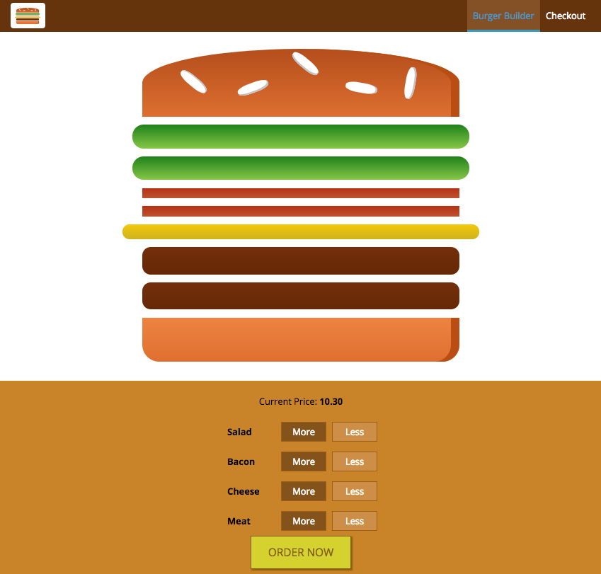
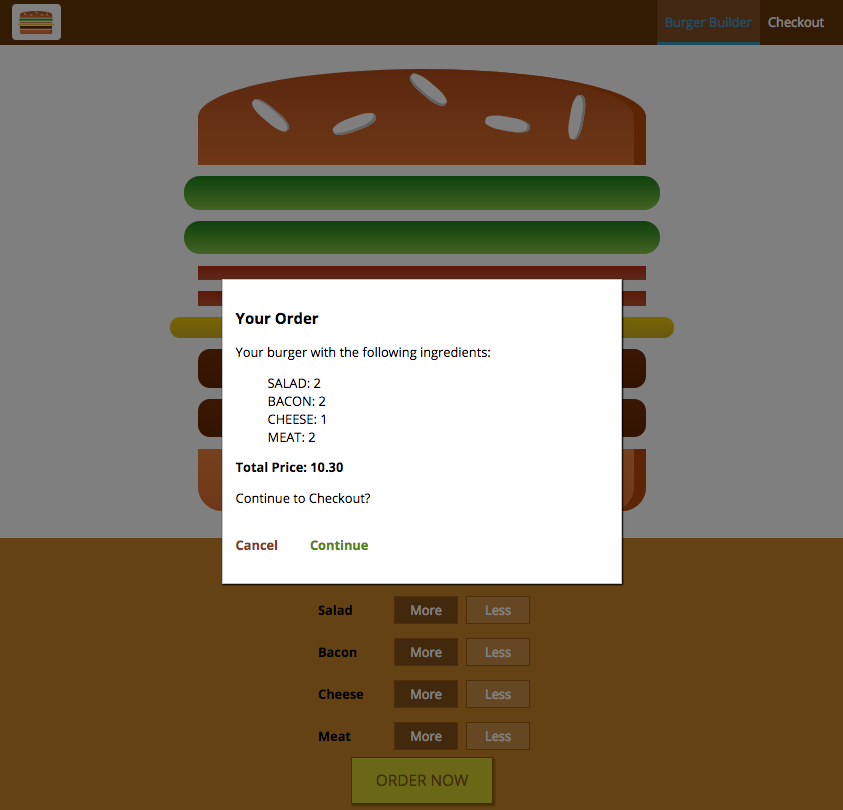
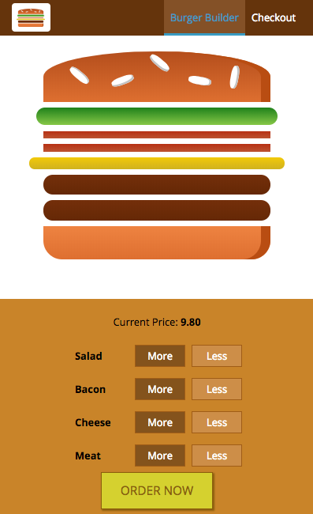
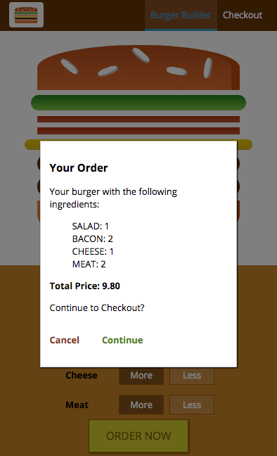

## Burger Builder

A responsive burger builder app built entirely in React.

****

Usage:

You must have npm installed on your local machine.

Create an empty directory and cd into it. Then execute the following commands in terminal:

`git clone https://github.com/mhijack/burger-builder.git`

`cd burger-builder`

`npm install`

`npm start`

****

When the screen gets smaller:

****

